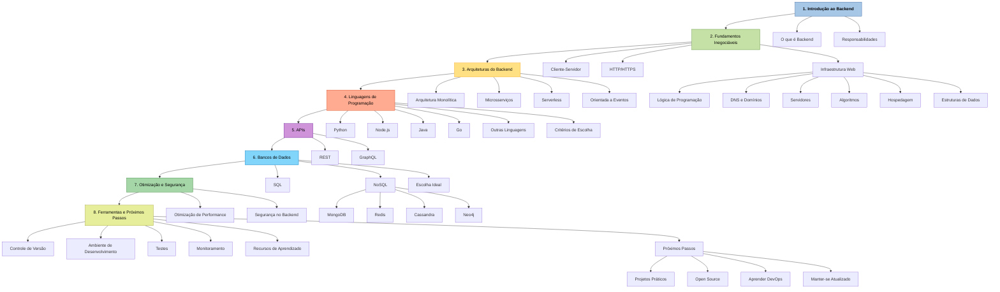

# Backend na veia

Esse **repositório** tem a finalidade de documentar o processo para o aprendizado em Backend.

<strong> Esse projeto tem a finalidade de organizar e mostrar exemplos do processo de desenvolvimento voltado ao Backend, o repositório ainda está em construção, sendo atualizado periodicamente.  </strong>

# Roadmap 

## 1. Introdução ao Backend

*   **O que é Backend:** A força invisível que sustenta as aplicações digitais, responsável por processamento, armazenamento e segurança.
*   **Responsabilidades:** Processar dados, gerenciar bancos de dados, implementar regras de negócio e garantir a segurança das informações.

## 2. Fundamentos Inegociáveis

*   **Comunicação Cliente-Servidor:** Modelo onde o navegador (cliente) faz solicitações ao servidor, que processa e retorna respostas.
*   **Protocolos HTTP/HTTPS:** Regras para transmissão de informações na web, com HTTPS adicionando criptografia.
*   **Infraestrutura Web:**
    *   **Lógica de Programação:** A arte de instruir o computador a realizar tarefas eficientemente.
    *   **DNS e Domínios:** Sistema que traduz nomes de domínio para endereços IP.
    *   **Servidores:** Computadores potentes que armazenam arquivos e código das aplicações.
    *   **Algoritmos:** Sequências lógicas de passos para resolver problemas.
    *   **Hospedagem:** Serviços que disponibilizam espaço em servidores.
    *   **Estruturas de Dados:** Listas, filas, pilhas e árvores para organizar informações.

## 3. Arquiteturas do Backend

*   **Monolítica:**
    *   **Descrição:** Todos os componentes da aplicação integrados em uma única base de código.
    *   **Vantagens:** Simplicidade no desenvolvimento, facilidade na implantação.
    *   **Desvantagens:** Difícil de escalar partes específicas, maior risco de falhas.
*   **Microsserviços:**
    *   **Descrição:** Divide a aplicação em pequenos serviços independentes.
    *   **Vantagens:** Escalabilidade individual, desenvolvimento independente.
    *   **Desvantagens:** Complexidade de gerenciamento, requer habilidades em DevOps.
*   **Serverless:**
    *   **Descrição:** Permite executar funções sem se preocupar com a infraestrutura.
    *   **Vantagens:** Escalabilidade automática, custos reduzidos (pague pelo uso).
    *   **Desvantagens:** Dependência do provedor de nuvem, cold starts.
*   **Orientada a Eventos:**
    *   **Descrição:** Componentes se comunicam por meio de eventos.
    *   **Vantagens:** Alta reatividade e escalabilidade, ideal para processamento em tempo real.
    *   **Desvantagens:** Complexidade de rastreamento, desafios de consistência de dados.

## 4. Linguagens de Programação

*   **Python:** Sintaxe clara e legível, ideal para iniciantes. Frameworks como Django e Flask. Usos: Web, IA, Análise de Dados, APIs.
*   **JavaScript (Node.js):** Permite desenvolvimento full-stack. Excelente para aplicações em tempo real. Usos: Tempo Real, Full-Stack.
*   **Java:** Robusta e escalável, amplamente usada em empresas. Framework Spring Boot. Usos: Empresarial, Alta Demanda.
*   **Go (Golang):** Desenvolvida pelo Google, foca em performance e concorrência. Ideal para microsserviços. Usos: Performance, Microsserviços.
*   **Outras Linguagens:** PHP, Ruby (Ruby on Rails), C# (.NET).
*   **Critérios de Escolha:** Tipo de projeto, ecossistema, mercado de trabalho e curva de aprendizado.

## 5. APIs: A Ponte entre Sistemas

*   **Definição:** Application Programming Interfaces - Recebem pedidos de um sistema e os entregam a outro.
*   **RESTful APIs:**
    *   **Padrão:** Mais utilizado para comunicação entre sistemas na web, baseado em métodos HTTP (GET, POST, PUT, DELETE).
    *   **Características:** Simplicidade e compatibilidade, Stateless (sem estado).
*   **GraphQL:**
    *   **Alternativa:** Permite aos clientes solicitar exatamente os dados que precisam.
    *   **Vantagens:** Reduz requisições, melhora performance, facilita evolução da API.
    *   **Desafios:** Curva de aprendizado mais íngreme, configuração mais complexa.

## 6. Bancos de Dados

*   **Bancos de Dados Relacionais (SQL):**
    *   **Organização:** Dados em tabelas com linhas e colunas, relações definidas por chaves. Ideais para dados estruturados.
    *   **Exemplos:** PostgreSQL, MySQL, SQL Server, Oracle.
    *   **Vantagens:** Consistência e integridade dos dados, consultas complexas com SQL, transações ACID.
*   **Bancos de Dados NoSQL:**
    *   **Vantagens:** Mais flexíveis e escaláveis, ideais para dados não estruturados e alta disponibilidade.
    *   **Tipos e Exemplos:**
        *   **Documento:** MongoDB
        *   **Chave-Valor:** Redis
        *   **Coluna:** Cassandra
        *   **Grafo:** Neo4j
    *   **Vantagens:** Escalabilidade horizontal facilitada, flexibilidade para diferentes tipos de dados, alta performance para grandes volumes.
*   **Escolhendo o Banco de Dados Ideal:**
    *   SQL para dados estruturados e relacionamentos complexos.
    *   NoSQL para escalabilidade e flexibilidade.
    *   Considerar abordagens híbridas.

## 7. Otimização e Segurança

*   **Otimização de Performance:**
    *   **Gerenciamento de Estado:** Armazena informações sobre a interação do usuário.
    *   **Cache:** Armazena dados frequentemente acessados para acesso rápido.
    *   **Otimização de Consultas:** Melhora a eficiência das consultas com índices.
    *   **Balanceamento de Carga:** Distribui o tráfego entre múltiplos servidores.
*   **Segurança no Backend:**
    *   **Injeção de SQL:** Proteção com consultas parametrizadas e ORM.
    *   **Cross-Site Scripting (XSS):** Proteção com validação e sanitização de entradas de usuário.
    *   **Autenticação e Autorização:** Proteção com autenticação de dois fatores, tokens JWT e controle de acesso.

## 8. Ferramentas e Próximos Passos

*   **Controle de Versão:** Git, GitHub, GitLab.
*   **Ambiente de Desenvolvimento:** VS Code, IntelliJ IDEA, Docker.
*   **Testes:** Jest, Pytest, JUnit, Postman.
*   **Monitoramento:** Prometheus, Grafana, ELK Stack.
*   **Recursos para Aprendizado:**
    *   **Plataformas de Ensino:** Rocketseat, Alura, Udemy, Coursera, freeCodeCamp.
    *   **Documentações:** MDN Web Docs, documentações oficiais.
    *   **Comunidades:** Stack Overflow, GitHub, Dev.to, fóruns específicos.
*   **Próximos Passos para Evoluir:**
    1.  Construir Projetos Práticos.
    2.  Contribuir com Open Source.
    3.  Aprender DevOps (CI/CD e containerização).
    4.  Manter-se Atualizado.

